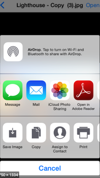

# 實作證書下載

## 目錄

- [流程](#流程)
- [Canvas是什麼?為什麼要用它?](#canvas是什麼為什麼要用它)
- [那Canvas要怎麼畫?](#那canvas要怎麼畫)
- [畫好了，然後?](#畫好了然後)
- [Android權限處理](#android權限處理)
- [IOS需要權限嗎?](#ios需要權限嗎)
- [那檔案下載的路徑怎麼取得?](#那檔案下載的路徑怎麼取得)
- [一切準備就緒，來創建PDF吧](#一切準備就緒來創建pdf吧)
- [創建完後下載下來](#創建完後下載下來)
- [總結](#總結)


## 流程

實作證書下載，須將各個步驟拆解出來，否則單看字意，感覺好像很簡單麻！

根據需求，將步驟拆出以下步驟：

- Canvas：畫出 證書圖片
- CheckStoage：確認使用者下載權限
- Get download path：取得下載路徑
- create PDF：創建一個PDF檔案，並將圖片塞滿到PDF後，下載下來

以下將一一解釋，各個步驟的邏輯和實作，可能還有更好的方法，再視情況參考囉

<br>

## Canvas是什麼?為什麼要用它?

簡單來說，就是畫畫！我們要用畫的方式，將文字畫在空白證書上面，空白證書像是下圖這樣(只是舉例，這是網路隨便找的，來源 [PngTree](https://zh.pngtree.com/freebackground/certificate-background-material-pattern_132365.html))


<br>

那為什麼不用 `<ImageBackground>` 把圖片當成背景，使用`<Text>` 蓋在上面？

原因如下：

- 我們最後是要下載下來，所以只是畫面呈現，最後還是沒辦法實作出下載
- 就算只是要呈現，文字位置和圖片上面的邊框間距，也很難調整(會因為手機尺寸不同而不同)

<br>

## 那Canvas要怎麼畫?

首先React Native不像Html一樣有 `<Canvas>`可以用，所以我們需要安裝套件

- [react-native-canvas](https://github.com/iddan/react-native-canvas)

(題外話，在網路上找了很多相關套件，但還是只有這個套件相對比較多人使用，我很抗拒的理由是，他的文件內容真的有點太少了....)

好在他有example可以參考，就直接從程式裡面看用法囉~ ([example code](https://github.com/iddan/react-native-canvas/blob/master/example/App.js))

<br>

所以針對怎麼畫的問題，可以先安裝套件

`yarn add react-native-canvas`

再來就是用法問題了！

<br>

分成四個部分說明：

- 引入到React Native
- 產生畫布還有背景圖片
- 根據需求畫畫
- 導出成base64的圖片

<br>

### 引入到React Native

一開始需要在render() 或是 return() 中，使用 `<Canvas>`

```javascript
import Canvas from "react-native-canvas";

const CertCanvas = (props) => { 
  const handleCanvas = (canvas) => {
    if(canvas){
      // 畫畫囉~   
    }
  }
  
  return (
  	<Canvas ref={handleCanvas} style={{width: 0,height: 0}}/>
  )
}

export default CertCanvas;
```

有兩個地方(坑)要說明一下

- `style={{width: 0,height: 0}}`：就算長寬都設成0，它實際上還是會畫出來(只是沒有呈現出來)，所以要看你要不要顯示囉，如果不呈現給使用者，可以在背景畫完就好，因為我們的目的只是要它畫完，然後存成一個base64的圖片給某個變數，最後這個變數再傳給PDF並下載下來(這部分後面會說到)

- `if(canvas){  // 畫畫囉~  }` : 會發現這邊有做一個if判斷，我看example code是沒有提到，但issue ([image must be initialized with a canvas instance](https://github.com/iddan/react-native-canvas/issues/133)) 上倒是有人有提出來，總之，有時候canvas會是null，如果這時再針對他去操作畫畫的函數，就會跳出error囉~

<br>

### 產生畫布還有背景圖片

順利引入完後，就可以開始畫畫了，由於我們要有張空白證書當背景圖片，所以邏輯流程就會是：

- 先設定好畫布的大小 (不然就會有預設值)

  - 由於最後要變成A4大小的PDF，所以畫布一開始就要**畫得大張一點**，否則之後放大就會變得很模糊 (IOS的畫布高度上限好像是1100，因為我試下來，超過1100就顯示不了)

  ```javascript
  const handleCanvas = (canvas) => {
    ...
    	canvas.width = 1558;
      canvas.height = 1100;
    ...
  }
  ```

- 取得Canvas的2D畫布以及他的繪圖方法

```javascript
const handleCanvas = (canvas) => {
  	...
    const context = canvas.getContext('2d');
    ...
  }
}
```

- 設定畫布背景圖片 (產生CanvasImage物件)
  - 這邊有個坑，我試了很久，但在講這個坑前，要先說說React Native放圖片的方式有以下四種：
    - 放在local的資料夾，使用require("圖片位置")去取得
    - 放在Android和IOS的資料夾，使用個別路徑取得([How to give the path of local image to add in canvas. #161](https://github.com/iddan/react-native-canvas/issues/161))
    - 得到遠端放圖片的url，使用url
    - 將圖片轉成base64，然後存放在local的檔案中，使用時直接用這個base64即可
  - 前面三種我在用的時候，最後再轉成base64圖片(使用`canvas.toDataURL(...)`)時，都會遇到 `CrossOrigin的污染畫布問題`，第三種得到遠端url還可以理解，第一二種local的檔案，為什麼會有跨域問題啊....
  - 總之按照網路教學，使用 `image.crossOrigin="anonymous";` 應該就可以了吧？
    - 沒想到狀況還是一樣Q
    - 可能是前端網頁上的狀況和套件的使用還是有出入吧...
  - **最後使用第四種，將背景圖片存成base64才可以順利使用到最後的 `canvas.toDataURL(...)`**

```javascript
import Canvas,{Image as CanvasImage} from "react-native-canvas";
const handleCanvas = (canvas) => {
  	...
  	let image = new CanvasImage(canvas);
  	image.src = "data:image/png;base64,xxxxxxxx.........";	// 背景圖片
  	image.addEventListener('load',() => {
      // context在上面宣告過了
      context.drawImage(image, 0, 0, 1558, 1100);	// 與上面畫布大小設定一樣
      ...
    })
  	...
  }
}
```

<br>

### 根據需求畫畫

終於把前面的準備工作都準備好了，可以開始畫畫了！

- 畫字 & 測量你要畫的字長度多少

  - 先宣告字體的style
  - 字體的顏色
  - 將「王小明」在 (105, 265) 開始寫
  - 測量你要畫的字長度多少
    - 記得要用非同步，不然抓不到值 (網頁的好像不用非同步)

  ```javascript
  let userName = "王小明";
  image.addEventListener('load',async () => {
    context.drawImage(image, 0, 0, 1558, 1100);
    context.font = 'bold 90px Microsoft JhengHei';
    context.fillStyle = 'rgba(120, 123, 105, 0.5)';
    context.fillText(userName, 105, 265);
    const userNameMeasure = await context.measureText(userName);
    const usernameWidth = userNameMeasure && userNameMeasure.width;
    // 下面會使用到 usernameWidth 的長度來畫畫
  })
  ```

- 畫線

```javascript
...
context.beginPath()
context.moveTo(95, 255)		// 畫線開始位置
context.lineTo(95 + usernameWidth + 42, 255)		// 畫線結束位置
context.lineWidth = 3.5;
context.strokeStyle = 'rgba(120, 123, 105, 0.5)';
context.stroke();		// 開始畫線
...
```

<br>

### 導出成base64的圖片

如同前面說的雷，現在到了使用 `toDataURL` 將圖片導出來了！

```javascript
image.addEventListener('load',async () => {
  ...畫畫
  
  let output = await canvas.toDataURL("image/jpeg"); // png也行
  // output就會是一個base64的圖片了
})
```

<br>

## 畫好了，然後?

很顯然的，這串很長的程式碼，我們應該要拉出來做，把它包裝成Component，給別的Component使用，所以我們最後會產生一個名為 `<CertCanvas>` 的Component，在需要的地方放進來

```javascript
import React from "react";
import CertCanvas from "./CertCanvas";
const App = () => {
  
  // 這樣就會在背景畫我們的證書了
  return(
    <View style={{flex:1}}>
    	<CertCanvas />
    </View>
  )
}

export default App;
```

<br>

## Android權限處理

為什麼會提到權限呢？

因為我們要將這張證書下載下來，下載下來就要取得使用者的Storage權限，不然沒辦法下載！

記得要去AndroidManifest.xml增加權限

```xml
    <uses-permission android:name="android.permission.WRITE_EXTERNAL_STORAGE"/>
    <uses-permission android:name="android.permission.READ_EXTERNAL_STORAGE"/>
```

<br>

<br>

這時候需要使用React Native的 `PermissionsAndroid` 來確認

建議可以先寫一個模組專門處理storage相關權限，要用的時候call即可

```javascript
import {PermissionsAndroid} from "react-native";

export const NEVER_ASK_AGAIN = PermissionsAndroid.RESULTS.NEVER_ASK_AGAIN;
export const StoragePermissions = [
    PermissionsAndroid.PERMISSIONS.WRITE_EXTERNAL_STORAGE,
    PermissionsAndroid.PERMISSIONS.READ_EXTERNAL_STORAGE
];

export default class StorageHelper{
    // 跳出彈窗詢問權限
    static request = async () => {
        try {
            return await PermissionsAndroid.requestMultiple(StoragePermissions);
        } catch (err) {
            console.log('request permission error !', err);
        }
    }

    // 確認權限
    static check = async () => {
        try {
            return await PermissionsAndroid.check(StoragePermissions[0]) && 
                    await PermissionsAndroid.check(StoragePermissions[1]);
        } catch (err) {
            console.log('check permission error !', err);
        }
    }
}
```

<br>

這時候模組已經寫好了，接著就是在需要的地方使用它

- 注意！`PermissionsAndroid.requestMultiple` 得到的結果會有以下三種
  - `GRANTED`: 'granted'
  - `DENIED`: 'denied'
  - `NEVER_ASK_AGAIN`: 'never_ask_again' (這是拒絕第二次，且使用者有勾選「不再詢問」後的狀況)

```javascript
import StorageHelper,{StoragePermissions,NEVER_ASK_AGAIN} from "./src/StorageHelper";

const onClickedPermission = async () => {
    try{
      let res = await StorageHelper.request();
      let isNeverAskedAgain = false;
      for(let i = 0;i < StoragePermissions.length;i++){
          if(res[StoragePermissions[i]] === NEVER_ASK_AGAIN) isNeverAskedAgain = true;
      }
      if(isNeverAskedAgain){
        throw new Error("使用者未授權");
      }
      else{
          let chkRes = await StorageHelper.check();
          if(chkRes === true){
            // Next Step
          }
          else throw new Error("使用者未授權");
      }
    }catch(err){
      // 可以跳出提示和使用者說明狀況
      throw new Error(err);
    }
  }
```

<br>

## IOS需要權限嗎?

- 這邊我是使用到 `RNFetchBlob` 的方法，以**UIDocumentInteractionController**方式打開檔案的，所以不需要權限

  - 

  

- 所以需要安裝套件 [rn-fetch-blob](https://github.com/joltup/rn-fetch-blob)

  - `yarn add rn-fetch-blob`
  - `cd ios && pod install`

- 安裝後需要再打開檔案的地方，使用套件的方法，即可打開檔案

  - previewDocument：跳出小彈窗讓使用者選擇分享的位置

  - openDocument：打開檔案，並可以在右上角選擇要分享去哪裡

  - 這邊我是用previewDocument來做，不過哪一種都可以

    - ```javascript
      import RNFetchBlob from 'rn-fetch-blob';
      
      const App = () => {
        ...
        RNFetchBlob.ios.previewDocument(filePath);
        ...
      }
        
      export default App;
      ```

<br>

## 那檔案下載的路徑怎麼取得?

其實好像 [rn-fetch-blob](https://github.com/joltup/rn-fetch-blob) 也有方法可以得到路徑，不過我在文件中沒有找到，所以就安裝了這個也是蠻常用的套件 [react-native-fs](https://github.com/itinance/react-native-fs)

`yarn add react-native-fs`

`cd ios && pod install`

<br>

邏輯上，會先判斷使用者手機容量夠不夠，不夠的話也不讓他下載...

- 判斷容量大小 (如果keepSize沒傳參數，就是預設值10MB)

- 取得路徑 (Android和IOS的路徑不一樣喔！)

  - Android 好像也可以用 `DocumentDirectoryPath`，但總之我使用這個路徑是可以用的，詳細還是看文件囉！([react-native-fs](https://github.com/itinance/react-native-fs#Examples))

- ```javascript
  import RNFS from "react-native-fs";
  import {Platform} from "react-native";
  
  const DEFAULT_KEEP = 1024 * 1024 * 10;  // 10MB
  export const getLocalPath = async (keepSize = DEFAULT_KEEP) => {
      let spaceInfo = await RNFS.getFSInfo();
      if(spaceInfo.freeSpace > keepSize){
          let path = (Platform.OS === "android" ? 
              RNFS.ExternalStorageDirectoryPath
              : RNFS.DocumentDirectoryPath
          ) 
          + /download/;
  
          return path; 
      }
      else{
          // 錯誤處理
      }
  }
  ```

<br>

## 一切準備就緒，來創建PDF吧

做完以上的功能和設定後，終於進入最關鍵的創建PDF了，這邊剛接觸時我其實很害怕，畢竟App這邊產生PDF，我自己的所有App都沒有這個功能，所以不論是開發上的創建新文件，還是這功能在其他App的使用，我都是沒什麼經驗的，帶著徬徨的心情上網查了一下，竟然發現有這個寫得很完善的套件可以用！看更新日期和星星數也都超多人使用的，接下來就是要看最重要的部分，能不能支援React Native....?!

<br>

畢竟以前曾經有安裝個套件，卻一直卡在奇怪的錯誤，查了後才發現不支援React Native，接著我搜尋了一下這個套件，發現居然有支援React Native，就是它了！

<br>

[pdf-lib](https://github.com/Hopding/pdf-lib)

文件上說可以在任何 JS 環境上執行，那真的很厲害耶！

話不多說，來安裝吧

`yarn add pdf-lib`

<br>

邏輯上，和 「 **畫畫** 」 差不多 (與上面Canvas比較)

- ~~引入到React Native~~  **(不用在render裡面寫了)**
- 產生~~畫布~~ **PDF檔案** 還有 ~~背景圖片~~ **新增一頁PDF空白頁面**
- 根據需求畫畫  **(說是畫畫，也只是將圖片放進去)**
- 導出成base64的 ~~圖片~~ **PDF**

因為其實程式碼有點短，我就不分段了

```javascript
import {PDFDocument,degrees,PageSizes} from "pdf-lib";

// 傳進來要用base64的圖片
export const HandlePDF = async (img64) => {
    const pdfDoc = await PDFDocument.create();		// 創建PDF檔案
    const page = pdfDoc.addPage(PageSizes.A4);		// 新增一頁空白頁
    const jpgImage = await pdfDoc.embedJpg(img64);		// 將圖片放進去PDF檔案

    page.drawImage(jpgImage,{		// 開始畫畫
        x: 0,
        y: page.getHeight(),
        width: page.getHeight(),		// 這邊是要讓圖片塞滿這份PDF
        height: page.getWidth(),
        rotate: degrees(-90),
    });
    page.setRotation(degrees(-90));		// 橫式

    const pdf64 = await pdfDoc.saveAsBase64();
    return pdf64;
}
```

<br>

講講過程中的坑吧！

一開始出來的檔案是空白的，想說奇怪，應該要可以畫，後來發現原來是我不了解旋轉的方向和 (x,y)位置，所以它是畫到另一個方向，只是檔案上看不出來，但實際上有畫...

<br>

**所以當你遇到空白的頁面，且你很堅信自己有畫成功，試著把角度和 (x,y) 都歸成預設值吧！**

## 創建完後下載下來

先盤點一下，目前手上做了哪些事情

- 畫證書 (得到證書的base64圖片)
- 獲取Android權限 (為了要可以下載)
- 取得Android 和 IOS路徑 (得到下載的路徑)
- 創建PDF (得到base64的PDF)

<br>

又回到 `rn-fetch-blob` 表演的時間，這套件除了可以打開IOS的檔案，還可以確認路徑存不存在還有創建資料夾，對！我們需要這些功能來下載PDF

- 確認路徑存不存在
- 創建資料夾
- 創建PDF這個檔案在相對應路徑 (包含檔名)

<br>

```javascript
import RNFetchBlob from "rn-fetch-blob";

...
const createPDF = async (path,pdf64,fileName) => {
  ...
  if(await RNFetchBlob.fs.exists(path)){		// 確認路徑存不存在
    console.log("folder exist");
  }
  else{
    await RNFetchBlob.fs.mkdir(path);		// 創建資料夾
  }

  await RNFS.writeFile(file,pdf64,"base64");		// 創建PDF這個檔案在相對應路徑
  ...
}

```

<br>

這邊講一個檔名的坑，因為Android/IOS本質上是Linux/Unix的作業系統，所以檔名中盡量不要包含 `/*\<>:&|.` 這些特殊字元，斜線的話可以使用類似的字元取代 (eg. Unicode的    \uFF0F)


## 總結

